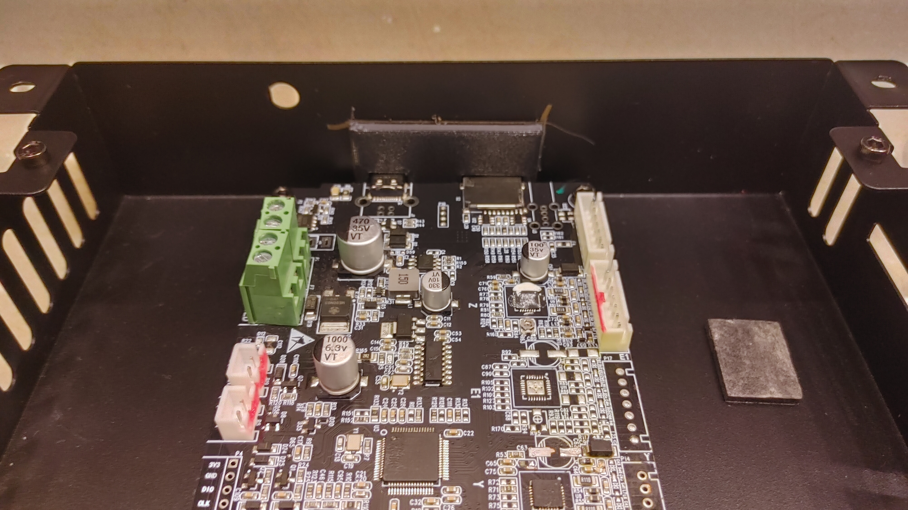
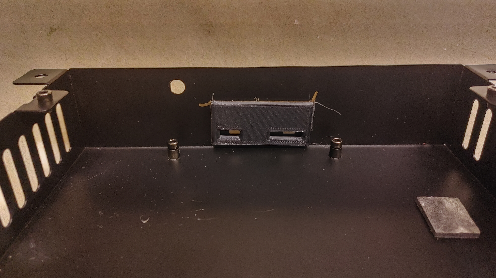
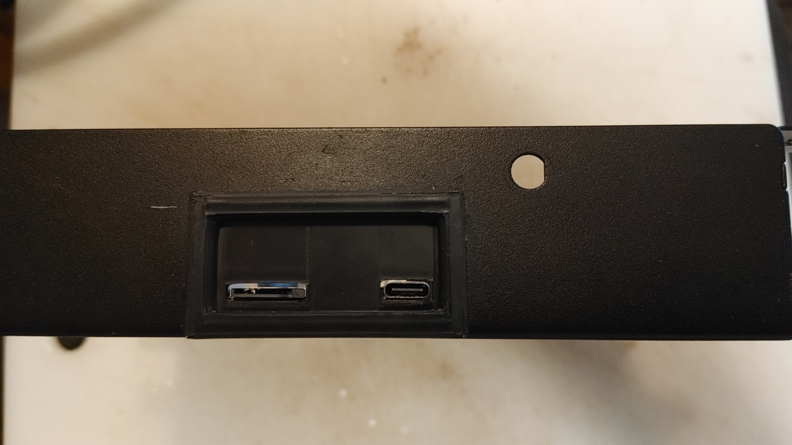
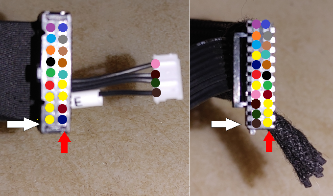
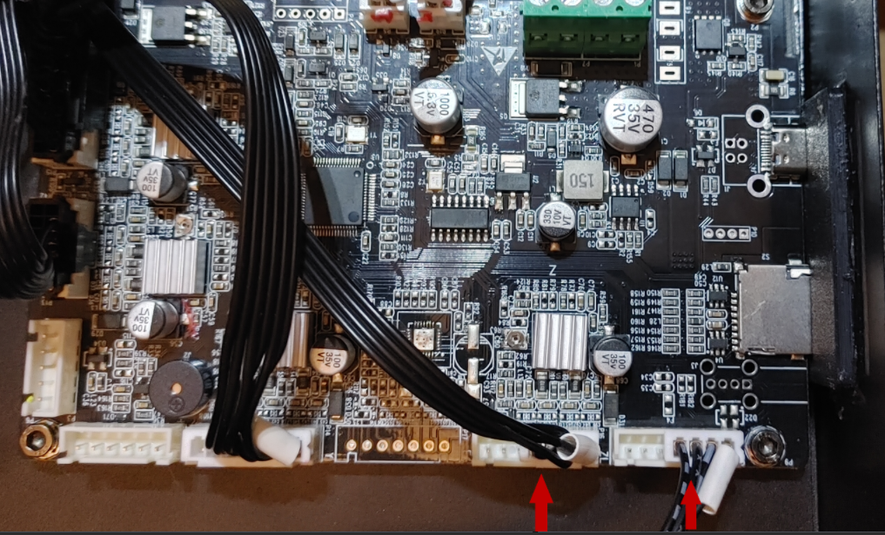

# K2MAXKlipper

Klipper installation on Anycubic Kobra 2 MAX with minimal cost or modification

A simple, easy and cost effective solution to install full mainline Klipper on your Anycubic Kobra 2 MAX.  
This will keep as many original parts as possible by replacing only the mainboard with a genuine Anycubic mainboard from a Kobra 2 coupled with minor physical modifications to the case and 3 connectors.

This is a great project for a weekend when you can focus and will not need your printer.  
Everything CAN be done in one day but it is best not to rush.  
Take your time and be VERY clear with what you are doing. Read the instructions below multiple times to be sure you are familiar, and comfortable, with all steps before you begin to do ANYTHING.  
If you have modified 3D printers previously this should be a very simple mod for you.  
If you have not modified a 3D printer before, but you enjoy using simple hand tools, you should have no trouble.  
Just go slow, read the instructions, and pay very close attention to what you are doing.  Take pictures along the way to help you keep track of the way things are BEFORE you disconnect anything in case you wish to reverse any of the mods.  
But most of all HAVE FUN!!!!!!

Please pay special attention to the section on the accelerometers.  
This is an OPTIONAL modification.  
You do NOT have to remove the bed accelerometer if you do not want to but at this stage BOTH the bed and printhead accelerometers will be disabled by this modification.  
This project is not fully completed and the intention is to get the stock accelerometers to work with the replacement mainboard.  
Until then a USB-C accelerometer (I use a BTT S2DW) is a simple solution to be able to set your input shaping calibrations.

---

## Modification instructions  

Please pay special attention to the secton on the accelerometers.  This is an OPTIONAL modification.  You do NOT have to remove the bed accel

Parts required:
- [Trigorilla_PRO_B_V1.0.2](https://1coderookie.github.io/Kobra2Insights/hardware/mainboard/#trigorilla-pro-b-v_102-stock) mainboard
- Raspberry Pi or Pi alternative to run Klipper(I use a BTT Pi adapter with CB1 board but an older laptop running Linux will work perfectly fine as well)
- Hole cutout template and cover plate (3D print them from included STLs)

Tools Required:

- 2.5mm Allen/hex wrenches
- Digital multimeter with continuity mode
- Dremel tool with fiberglass cutoff wheels
- Small fine file
- Super glue
- A working 3D printer to print off required parts (you can print them on your MAX before you do the mod)
- xacto knife to trim connectors (I prefer #11 blade)
- zip ties for cable management
- double sided tape

These instructions are intended to help make it simple and very inexpensive to convert your Kobra 2 MAX to run full mainline Klipper.  
The ONLY part that will need to be purchased (assuming you already have a Pi or equivalent) is the mainboard.  
I specifically did this project in this way so I could use my spare Trigorilla_PRO_B_V1.0.2 from my Kobra 2 (Marlin version) which has also been upgraded to Klipper because when it comes down to it I am very cheap and hate buying things I don't need to.  lol  

Using this board will also require the minimal amount of physical modification to the printer case and connectors AND it means that ONLY Anycubic parts and electronics will be used...so technically this is still an Anycubic printer, just how it SHOULD have been done by Anycubic in the first place.  
It also has the exact same hole pattern/spacing as the stock mainboard which makes installation very simple with NO additional hardware required.  
Please also note that this project is not 100% completed yet and as changes are made or new information comes to light these notes and instructions will be updated accordingly.

PLEASE BE AWARE:  This modification as it currently stands will also remove the functionality of the built in accelerometers in both the printhead and bed.  
This is NOT a permanent change however and plans are in place to figure out how to incorporate the stock accelerometers into this modification.  
The one in the bed CAN be removed and repurposed for input shaping but I chose to use the BTT 2SWD USB-C accelerometer I already had on hand (USB-C is SO much easier to connect).  
I will leave up to you to decide what you find to be best for YOUR application.  
Just be warned before you go ahead with this mod if this is going to be an issue for you.  
This modification will also disable the LCD functionality but you can either add your preferred screen to your Pi or use the mainsail web interface (my preferred choice), or fluid, if you prefer.

To begin you will need to print off the hole cutout template to locate the hole you will need to cut in the front of the case to allow for the SD card slot and USB-C port.  
You will also need to print off the cover plate to fill the hole and provide a cleaner look.  
Both STLs have been included.  
To properly locate the template simply place a small piece of double sided tape on the side facing AWAY from the board, slide it over the USB-C port and SD card slot and then place the new board onto the existing mounting holes (image 1).  

Be sure to line up the mounting holes as best as possible.  
When the board is properly located and mounted press the template against the inside of the case to allow the double sided tape to hold it in place (image 2).  

Remove the board and trace/scribe around the perimeter of the template to mark your cut lines.  
I found it easiest to cut with a Dremel tool and fiberglass cutoff wheel directly on the scribed lines to allow for a little bit of "wiggle room" when installing the cover plate.  
Once the hole is cut be sure to file the rough edges to remove any burrs or jagged edges and then fully clean the case, inside and out, to remove ALL traces of metal shavings.  
This is critical to prevent any short circuits on the board.

Now mount the new board on the existing stand-offs and use the original screws to secure it.  
Do not tighten the screws completely as you may need to adjust position slightly.  
Place the cover plate you printed into the hole you just cut, lining up the SD card slot and USB-C port. Position the cover plate so that the bottom edge is flush with the edge of the case (image 3).  

Use your favourite glue to permanently attach the cover plate to the face of the case.  
I used cheap dollar store super glue but 5 minute epoxy would be a great choice as well.  
I would advise inserting a USB-C cable into the USB-C port first to make sure it is properly aligned to make future insertion easy.  
Once you have applied the glue use small clamps or painters tape to hold it in place so you can remove the screws holding the board in the case, and then CAREFULLY remove the board to prevent ANY glue or residue from contacting the board.  
Leave it to fully dry/cure (I left it overnight) and then remove the clamps to see the finished result (image 4).  

That is all for the board replacement and case modifications.

Now you need to modify the wire harness to the printhead. The mainboard end connector of the wire harness will need to be modified but the printhead connector will be left as-is and this will allow you to use the stock red ducted printhead.  
As the replacement mainboard has a 22 pin connector and the original mainboard (which has now been removed) uses a 24 pin connector you will have to trim one pair of pins off of the edge of the connector.  
It is best to remove ALL pins from the connector first as you will need to do this anyway to match the pinout of the new board.  
To remove the pins from the connector you will need to press down gently on the small tab that locks the pin in place while GENTLY pulling on the wire connected to THAT specific pin.  
Be VERY careful and only use just enough pressure to get the job done.  
You do NOT want to damage any of the pins.  
Go slow and once the pin starts moving pull it out of the connector and stop putting pressure on it.  
Start at one end of the connector and just go pin by pin until all are removed.  
You do not need to worry which pin is which at this point.  
Just get them all removed without damaging any.  
If you need to use ANY force STOP!!!!  
Once the tab is pressed down enough the pin will slide out easily.

Trim off the edge of the connector that faces the outer edge of the board and use the xacto knife to take off small slices at a time until you can fit the connector back into the connector on the board.  
I went a LITTLE too far and cut into the pin slot but this didn't cause any issues.  
Don't do what I did and try to take too much off at a time (image 5).  

Again, go slow and be careful not to cut yourself. Ask me how I know.

With the pins all removed and the connector trimmed you will now need to match the pinout from the printhead side connector to the pinout of the new mainboard.  
Due to the differences in the printhead boards from the old and new printheads (ie older style black duct using the V0.1.5 board and new red ducted style using the V1.0.1 board) we MUST change the pin placement in the mainboard end connector of the wire harness. 

**WARNING:**    
Failure to match the pins correctly WILL result in printhead board and/or mainboard damage so take your time, follow the colour coding and test with a multimeter in continuity mode MULTIPLE times.  
This part MUST be done correctly and WILL be the single most critical part of this printer modification!!!!!!!!  
Please pay VERY close attention to the orientation of the connectors as shown in image 6.  

The images are of the connectors face on with the key/locking tab facing the left side.  
Be sure to match this orientation when looking at your connectors.  
I cannot stress this enough!!!! 
 

The printhead board uses an 18 pin connector whereas the new mainboard uses a 22 pin connector.  
The old mainboard you removed uses a 24 pin connector and we have to get them all to play nicely with each other.

With the pins fully removed from the mainboard connector do a simple continuity check on both ends one pin at a time.  
Follow the colour code in image 6 one pin at a time beginning with pin 1 on the printhead connector (left side of image 6) and move upwards, over to the right side and then downwards until all pins have been moved.  
Pin 1 on both connectors is marked with the white arrow.  
Pin 18 on the printhead connector and pin 22 on the board connector are marked with the red arrow.  
Start at pin 1, find the corresponding free pin on the other end and insert that pin into the appropriate hole on the mainboard side connector (the one you removed the pins from) that is marked with the same colour dot.  
For example pin 6 on the printhead connector is marked with a black dot and its corresponding hole on the mainboard connector is pin 17.  

*Please note:*  
The pins marked with yellow dots (5 in total) are NOT CONNECTED/UNUSED.  
You should NOT add any pins to these locations.  
As well, due to the differences in the printhead board versions, the old style has the extruder motor pins included (right side of image 6) in the printhead connector whereas the newer style has a separate stepper motor connector (left side of image 6).  
There WILL be 5 pins that will NOT be used (shown wrapped in tape on the right side of image 6) and these are for the accelerometer built into the V1.0.1 printhead board. This accelerometer WILL BE DISABLED because of this modification!!!  
Be sure to wrap each pin individually with electrical tape or use heat shrink tubing to make certain they do NOT touch.  
Do NOT cut these pins off!!!

Once you have placed the appropriate pins into the appropriate spots in the board connector I STRONGLY advise you to do a continuity test on each pin, going over the entire connector, 2 to 3 times (at a minimum) to be 100% certain that you have properly matched the pinout colour coding shown in image 6.  
DO NOT SPEED THROUGH THIS STEP!!!!! I CANNOT stress this enough!!!

The only other modifications REQUIRED are to the Z motor connectors.  
The new board uses a 7 pin connector but the cables have a 4 pin connector with 2 alignment tabs.  
You will need to trim off the one tab where the red arrows in image 7 are pointing.   

Be sure to insert the connectors as shown in image 7.  
The 3 unconnected pins are not used. Do not simply try to force the connector in unmodified as you stand a VERY good chance of damaging the board connector or the board itself.

An OPTIONAL, but not required, modification (I chose to do this) is to remove the accelerometer and calibration button from the bed as they will not be used with Klipper at this stage in this project.  
You can leave these in place if you wish but you will get a cleaner look by removing them.  
You will need to slip all of the cables out of the mesh sheath of the bed cable harness and separate the power wires and thermistor wires from the others.  Slide the bed power cables and thermistor wires back through the mesh sheath and properly secure to the strain relief connector on the bed using a zip tie.  Put the other cables aside as you will not need them.  
Be VERY careful not to damage the solder joints here or else you will need to repair them by resoldering.  
Due to the large mass of the bed you WILL need a powerful soldering iron (at least 60W) to effectively melt the solder.  
It's best to just avoid having to do this.  
There is a 2 pin connector soldered to the bed that connects the calibration button.  
This can be simply clipped off at the solder joints or you can choose to desolder if you wish.

Now...all you have to do is put the cabling back to where it goes on the board.  
The connectors inside the case are all labeled and go into the appropriately labeled mainboard connector (ie TO wire into TO port on the board) until they are all done.  
You can remove the LCD ribbon cable and LCD screen as these will not be compatible with Klipper and therefore not used.  
Please pay special attention to the connectors for the TO and case fan as they are directly beside each other and are exactly the same.  
Again...pay close attention to the labels on the mainboard.

Once you are done you should have the following parts removed from the printer: LCD ribbon cable, LCD screen, mainboard, and optionally: bed calibration button with built in accelerometer, calibration button cable (2 pin) and accelerometer cable (6 pin).  
You can save them all in a safe place in case you wish to return this printer back to stock (except for the hole you cut in the case and the trimmed connector of course) or you can choose to resell and recoup some of the costs (ie new mainboard and Pi alternative).

All images, STLs, printer.cfg and additional notes have been included in the zip file.  
Please feel free to modify the STLs to suit your liking.  
If you have any questions regarding this project please feel free contact me on Reddit (OldNKrusty) or by email at atomicmoped@hotmail.com

If you didn't come across it yet, visit [Kobra2Max Insights](https://1coderookie.github.io/Kobra2MaxInsights/) - it's a comprehensive infosite specifically about the Kobra 2 Max.  

Enjoy your new Klipperized Kobra 2 MAX.  

---

## Additional notes  

- As well it appears that the original Trigorilla_SPE_A_V1.0.0 mainboard (to be referred to as SPE going forward) uses genuine TMC2209 stepper driver ICs whereas the replacement Trigorilla_PRO_B_V1.0.2 board (to be referred to as PRO_B) uses GC6609 stepper driver ICs and the two are not 100% setting compatible/interchangeable but they are pin compatible.  
If a driver IC fails they SHOULD be able to be directly replaced with genuine TMC2209 ICs.

- The default acceleration value of 10000 with the SPE is FAR too high and will cause issues, specifically on the Y axis.  
The PRO_B max acceleration should be capped at 3000 in the printer.cfg file.  
I personally chose to cap my max acceleration at 2500.  
Due to the large mass of the bed I have no expectations of printing at breakneck speeds.  
I would prefer my prints to succeed slowly than fail quickly.

- You WILL also need to manually set the VRef for each stepper driver to ensure the correct current for each axis.  
Please start with the below START values and adjust as you see fit without exceeding the MAX values.  
If you find the motors begin running hot and start skipping steps you will need to lower the VRef in 0.02V increments.  
Lowering by more than 0.25V is not advised as this will lower the current too much.  

  | START Vref | MAX Vref |
  |:----------:|:--------:|
  | E: 0.60V = 0.75A | E: 0.64V = 0.8A |
  | X: 0.96V = 1.2A | X: 1.12V = 1.4A |
  | Y: 1.28V = 1.6A | Y: 1.52V = 1.9A |
  | Z: 1.12V = 1.4A | Z: 1.44V = 1.8A |  

  (Note: Z dual steppers running in parallel = 0.9A for each stepper)

- You WILL need to ensure adequate case cooling so please be certain to leave enough room for the case fan to ventilate the case.  It is also not a bad idea to replace the stepper driver heatsinks with larger 10*10*10mm heatsinks to increase the mass and surface area for better IC cooling ESPECIALLY if you are running higher currents.  
Setting motor current too high can significantly increase the temperature and dramatically shorten the life of the stepper driver ICs. Use or larger, higher mass heatsinks can HELP mitigate this but not eliminate it. I would advise using Vref as close to the START settings noted and printing slower to maximize stepper driver life.

- Even though the heated bed does come with a minimal amount of insulation I HIGHLY advise adding an aluminized foam insulation to help retain heat and reflect it back into the bed.  
This will help the bed heat faster and remain at a stable temperature.  
It will also help prevent the heat from being radiated to the top of the case and this in turn will keep the case internals cooler.  
I use a 1/4" thick self-adhesive aluminium backed foam designed for sound deadening and thermal insulation in automobiles. Similar to this: https://www.amazon.com/Car-Heat-Sound-Deadening-Insulation/dp/B0BNPZZ71X/ref=sr_1_4?sr=8-4
